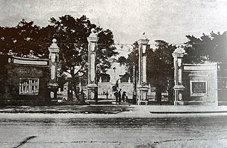
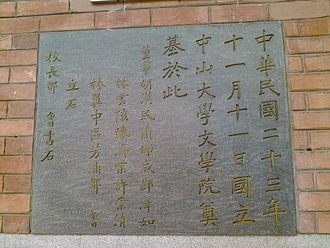
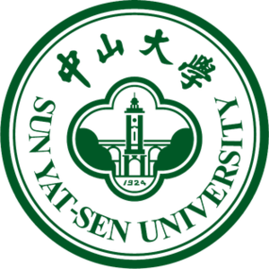
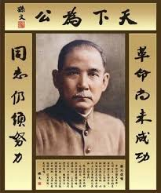
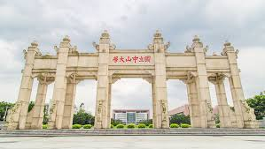
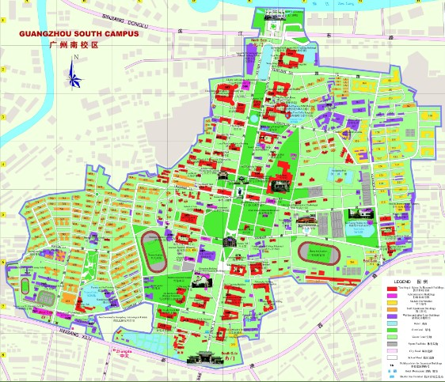

***一  中大起源***
国立广东大学时期

1924年2月6日，孙中山下达总统令，任命国立广东高等师范学校校长邹鲁为主任，筹建国立广东大学。邹鲁2月21日到任，即函聘王星拱、傅斯年、邓植仪、何春帆、梁龙、程天固等35人为筹备委员，成立筹备处，封准向广东各机关挪借开办经费。5月9日，筹备工作完成。6月9日，孙中山又以大总统令任命邹鲁为校长，同时“广东高等师范学校”、“广东公立法政大学”、“广东公立农业专门学校”合并升格“国立广东大学”。学校于9月19日开始上课，11月11日补行成立典礼，孙中山亲临典礼现场讲话，并题写校训。

1924年11月12日，国立广东大学正式成立，以邹鲁为校长。

按照当时《国立广东大学规程》，国立广东大学宗旨为：“以灌输及研究高深学理与技术，并因应国情，为图推广其应用为宗旨。”学校设校长1人，并设秘书长1人协助校务，下设图书主任、仪器主任、会计主任、学院院长等。设校务会议，由校长、各分科学长、预科主任以及全校教授互选若干人组成，评议、计划重要校务。国立广东大学成立时，文科学长为杨寿昌，理科学长为郜重魁。不少知名学者被聘来校任教。如文科的郭沫若、郁达夫、郑伯奇、成仿吾等；理科的何衍睿、张云、陈宗南等。

1925年，“广东公立医科大学”并入，增设医学院。

1926年3月，郭沫若就任文科学长，郁达夫任英国文学系主任。郭到任后对文科开始进行整顿，辞退了15名教授。4月，秘书处开始出版不定期杂志《学艺丛刊》，进行学术文艺讨论、社会改造研究、世界潮流批评、东西方名著介绍等。

---
1949年后
1952年，中国高校院系调整，广东的文理科高等教育经历了一次重大变革。10月，广州区高校调整委员会发文《以对人民负责的态度，做好院系调整工作》，进行全面动员。广东高校院系调整正式启动。

原国立中山大学的工、农、医、师等学院分别与私立岭南大学、华南联合大学及其他院校相关学科学院合并为四所专门学院。新的中山大学由原国立中大、岭南大学、华南联合大学的文理学院合并为基础组成，并将原广东及中南地区部分高校的有关系科调入，由原来的文法理工农医师7学院和1个研究院共31个学系的多科性综合大学拆分重组为只有文理双科的综合大学。学校仅设中国语言文学、外国语言文学、历史学、数学、物理学、化学、生物学、地理学8个系，全面按照苏联模式建立教学体系，以教研室（组）为教师活动的基础。

同时，校址也由当时广州东北郊的五山镇迁至岭南大学原址康乐园（今为南校区），私立岭大被杀校。原国立中大的工学院和农学院在原校园分别建立了华南工学院（华南理工大学）和华南农学院（华南农业大学）。校长仍为许崇清，原岭南大学校长陈序经为副校长。此次调整经历一年多，调整后的中山大学有教职工700多人，其中教授100多人，副教授40多人，讲师近60人；在校本科生1500余人，研究生5人，专修科生40余人；图书馆藏书达200万册。

1980年，中华民国政府另于台湾高雄市以复校名义成立“国立中山大学”；2000年9月，珠海校区在珠海市唐家湾建成；2001年10月26日，中山大学与中山医科大学（原中山医学院，由中山大学医学院和岭南大学医学院合并组建，1954年广东光华医学院并入）合并；2004年9月，东校区在广州市番禺区的广州大学城落成。

***二   中大简介***

`中山大学`（简称：中大；英语：Sun Yat-sen University，缩写为SYSU），位于广东省广州市、珠海市和深圳市，是中国大陆的综合性研究型大学，直属于中华人民共和国教育部，由教育部与广东省人民政府共建。
  注：因其英文名为Sun Yat-sen University（故译者戏称为“`双鸭山大学`”）

该校前身为孙中山先生于1924年创立的国立广东大学，1926年为纪念创始人`孙中山先生`
改称国立中山大学。1927年国民政府模仿法国“大学区”制度，在全国建立四所中央级“中山大学”，广州的国立中山大学改称为国立第一中山大学，1928年复名为国立中山大学。

1952年全国院系调整后直称中山大学。

---
***三  中大现状***

中山大学是“一流大学建设A类高校”和原“985工程”、原“211工程”重点建设大学，属于中国著名代表高校，具有人文社会科学、医科和理工多学科厚实基础，被誉为“华南第一学府”。在2018年世界大学学术排行榜中，中山大学位列中国大陆第4-7名，世界第101-150名；在2018泰晤士高等教育世界大学排名和2018U.S.NEWS美国与世界大学排名中中山大学位列中国大陆第8名；在2018年中国校友会网中国大学排行榜中，中山大学位列中国大陆第9名。

校区[13]
共有三个校区五个校园，总面积9.188平方公里；

广州校区
南校园（康乐园）：广州市海珠区新港西路135号（原岭南大学校址），占地1.208平方公里；

北校园：广州市越秀区中山二路74号（原中山医科大学校址），占地0.203平方公里；

东校园（大学城校园）：广州市番禺区小谷围岛广州大学城外环东路132号，占地0.989平方公里；

珠海校区：珠海市香洲区唐家湾，占地3.571平方公里。
珠海校区与高雄的国立中山大学，都是位于北纬22度线的临海校园。
而建筑中的横琴汇通三路的中大金融中心，由中山大学附属公司发展，乃中山大学唯一自行由土地市场上购入的校址土地，由一幢42层高的主楼及两幢32层高副楼组成；部分楼面将用作中山大学工商管理学院校舍，以及学术交流中心，其余写字楼楼面作为中山大学收租物业，唯租户以中山大学校友成立之企业优先（配额为30间）。
深圳校区：深圳市光明区，占地3.217平方公里。目前尚在建设中，预计于2018年9月启用（现定于2019年9月先启用医学相关科系教学设施）

---
***四  中大精神***

**校训**

1924年11月11日，国立广东大学成立典礼时孙中山先生亲笔题写了十字校训：**博学，审问，慎思，明辨，笃行**。校训原文出自《礼·中庸》第二十章：“博学之，审问之，慎思之，明辨之，笃行之。”

**校歌**

白云山高 珠江水长

吾校矗立 蔚为国光

中山手创 遗泽余芳

博学审问 慎思不惘

明辨笃行 为国栋梁

莘莘学子 济济一堂

学以致用 不息自强

发扬光大 贯彻主张

振兴中华 永志勿忘
<audio src='\homework\中唱群星 - 中山大学校歌.mp3' preload="auto" controls autoplay loop>中大校歌</audio>   

**中大校友之歌**

山高水长

陈小奇 词曲

你是一个动人的故事，讲了许多年
风里的钟楼，火里的凤凰，激扬文字的昨天

你是一支美丽的歌谣，唱了许多遍
灯下的背影，清晨的书声，青春不老的容颜

山高水长，根深叶茂

上下求索，海纳百川

悠悠寸草心怎样报得三春暖

千百个梦里总把校园当家园

你是一座高高的山峰，矗立在南天
肩上的道义，笔下的风采，铸成民族的尊严

你是一条长长的大江，延伸到天边
甘甜的乳汁，芬芳的桃李，连接四海的眷恋

---